# <strong> Brazilian exports and TFP

# Case 1 background

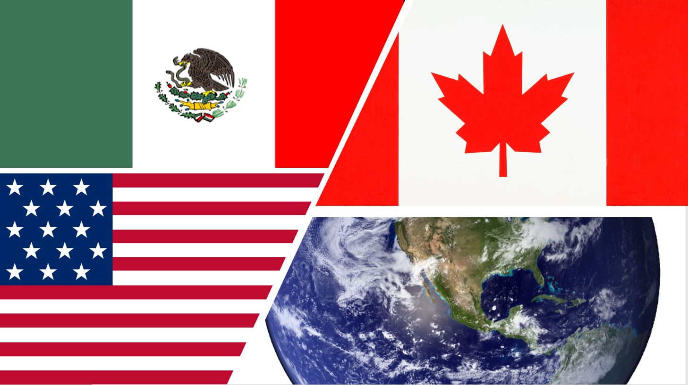
<h1>10 years forecast - USA/MEX/CAN</h1>

Open the TFP.csv file attached.

The series is composed by TFP (rtfpna variable) at constant national prices (2005 = 1) for three countries: United States (USA), Canada (CAN) and Mexico (MEX).

The goal is to make an exploratory data analysis and a 10 years forecast of the series.

Boxplot showing the TFP distribution of the three countries (USA/CAN/MEX)
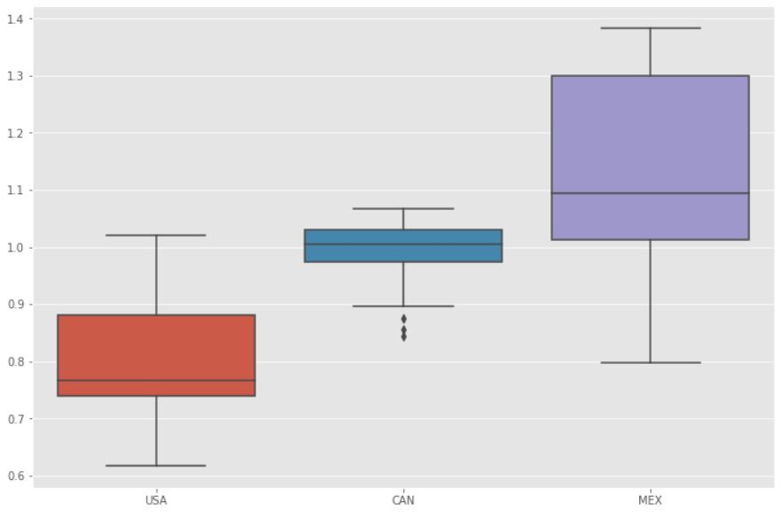

There is no evidence of outliers what is a good sign

That's the forecast for USA 
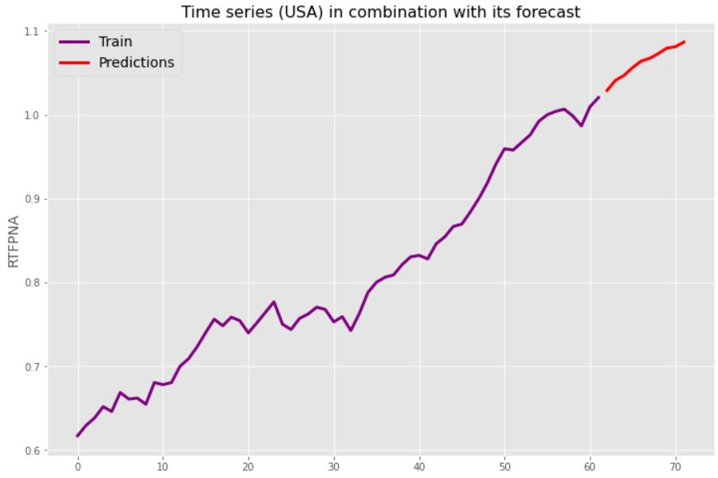
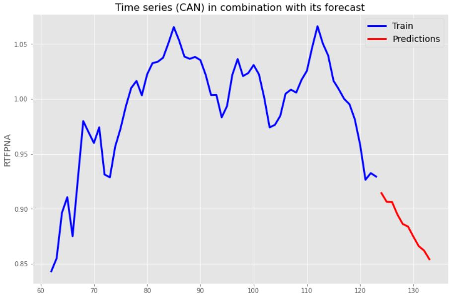
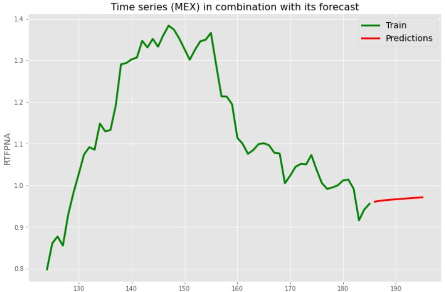

___

## Case 2 backgroung ##

<h1>Brazilian exportations</h1>

Comex Stat is a system for consulting and extracting data from Brazilian foreign trade. Detailed data on Brazilian exports and imports are released monthly, extracted from SISCOMEX and based on the declaration of exporters and importers. The system database is also available for download.

Comex Stat will be constantly evolving, seeking to improve usability and create new features for data exploration. In this sense, your opinion, criticism and suggestion will be very important for the improvement of the system. Please contact Comex Responde and send us your impression.

The dataset contains all trackings of monthly imports and exports of a range of products (soybeans, soybean meal, soybean oil, corn, wheat and sugar),by brazilian states, by routes (air, sea, ground, etc) e from/to which country;

  

The products exported by Brazil between 1997-2019
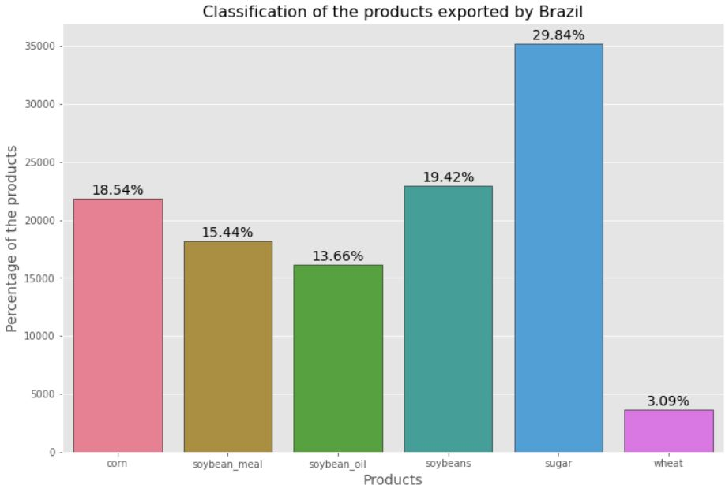

The routes are important to show the characteristics of the exported products. Sea is the most used form and it can be assumed that it is due to the cost and reach
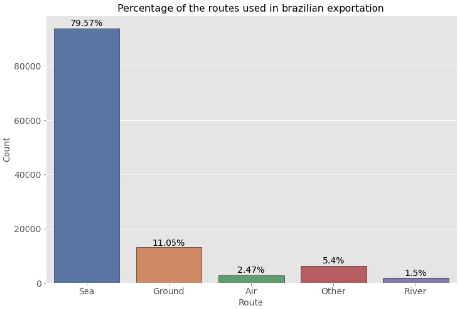

Each route is more apropriate for each product and it can be seen in this chart

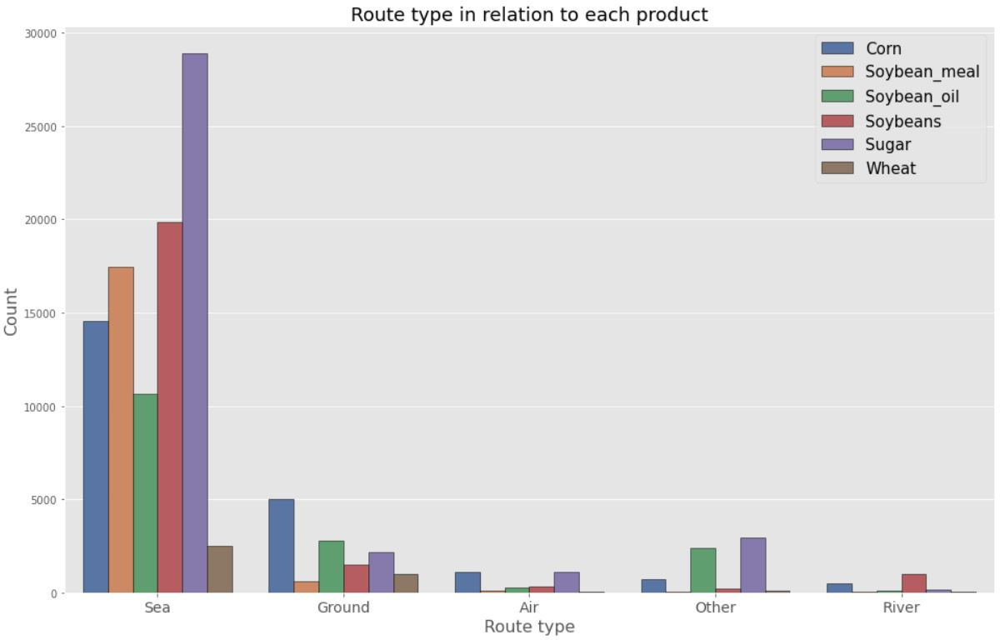

That's the forecast for the products: Corn, Soybeans and Soybeans_meal:

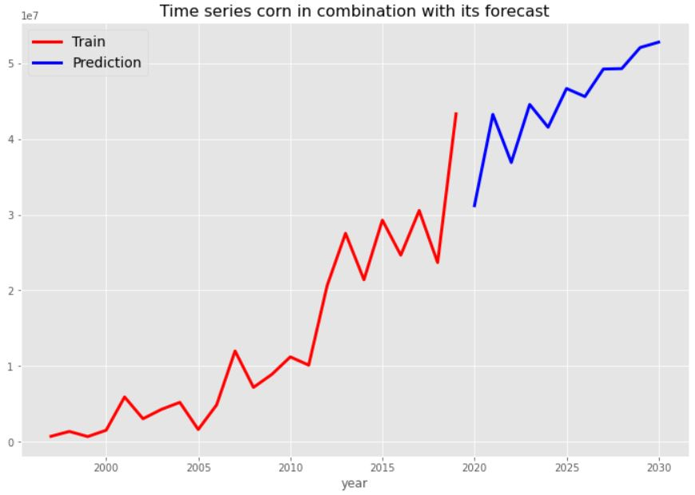
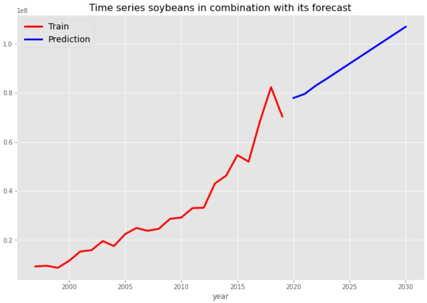
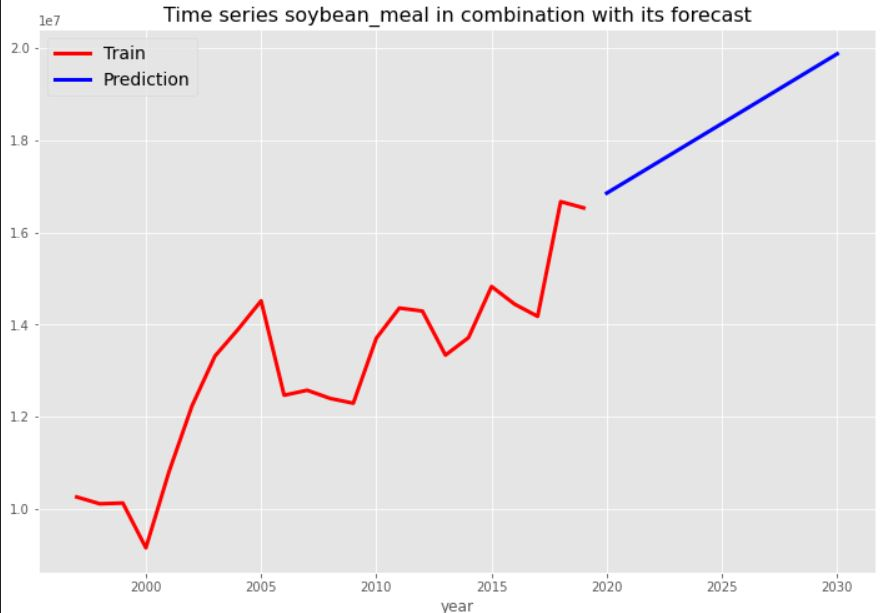
